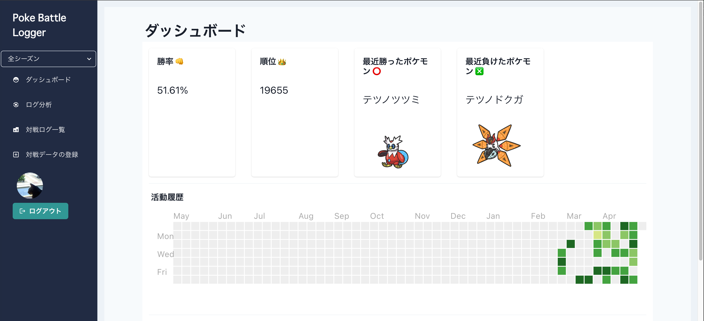
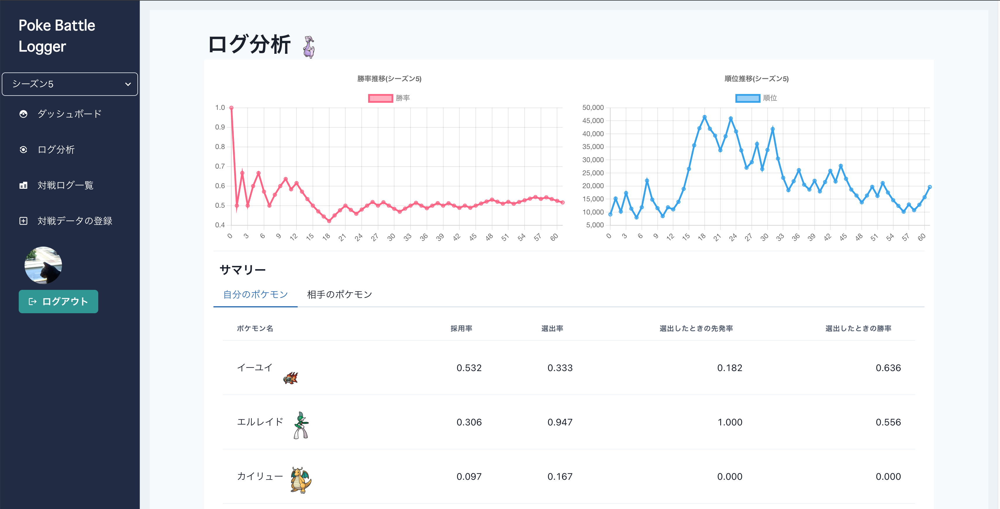
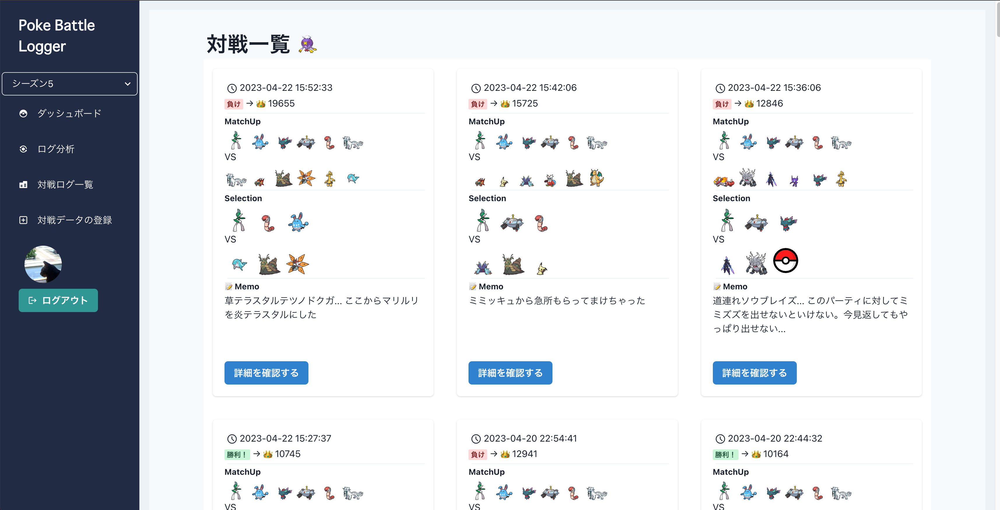

# PokeBattleLogger

<div style="display:flex;">
    
    
</div>
<div style="display:flex;">
    
    
</div>

ポケモンSV のランクマッチ(マスターボール以上) の youtube 配信から、対戦データを抽出します。

🚧 This app is Under Construction 🚧

## Notification

- 対応環境(2023/04/23 時点)
  - 言語選択が英語・日本語の場合のみに対応しています。
    - 日本語の場合、精度が若干下がります
  - 動画のサイズは 1080p: 1920 x 1080 のみに対応しています。
- 動画は次のような流れになっている必要があります。
  - (スタート)バトルスタジアムを選択 → シングル・ダブルを選ぶ画面 → シングルを選択して対戦を開始 → 対戦終了 → 続ける or バトルチームを変更 でランクを表示 → ... → バトルチームを変更 を選んでランクを表示して、10秒ほど待ってから動画を終了
- 何らかの理由で順位が変動しなかった試合についてはデータ抽出を行いません。

## Setup

Pyton 3.10 +

```
poetry install
```

また Tesseract のインストールが必要です。英語だけでなくポケモンで利用できる全ての言語についての設定が必要です。

- 日本語
- 中国語(簡体字と繁体字)
- 韓国語
- フランス語
- スペイン語
- イタリア語
- ドイツ語

インストール方法は各サイトを御覧ください。

tessdata は best を使います。

### credentials

`poke_battle_logger/poke_battle_logger_vis/.env.local` に以下を配置
- NEXT_PUBLIC_AUTH0_DOMAIN
- NEXT_PUBLIC_AUTH0_CLIENT_ID

また、検出に失敗した際、そのテンプレート画像を GCS に送信しています。
GCS へのアクセス権限を持ったサービスアカウントの認証情報を json でダウンロードして以下に配備してください。

`.credentials/google-cloud-credential.json`

## アプリケーションの起動

```
make run_api
make run-dashboard
```

```
POSTGRES_DB={} POSTGRES_PASSWORD={} POSTGRES_USER={} POSTGRES_HOST={} POSTGRES_PORT={} make run_api_local_use_postgres
```

### For Unknown Pokemon Image

UI から「対戦データの登録」で対戦データを登録しようとした際に、次のようなエラーが出ることがあります。

```
Exception: Unknown pokemon exists. Stop processing. Please annotate unknown pokemons.
```

この場合、 `template_images/unknown_pokemon_templates` を見ると、検出に失敗したポケモンの画像が収録されているかと思います。
これを各ポケモンごとに最低1枚、{正しいポケモン名}.png に画像ファイル名を変更して、`template_images/labeled_pokemon_templates` に移動させてください。
同じ名前のファイルが既にある場合は、{正しいポケモン名}_{任意の番号}.png という名前にして被らないようにしてから移動させてください。

その後、 `make train-pokemon-image-classifier` を実行することで、次回のデータ登録からは反映されるようになります
