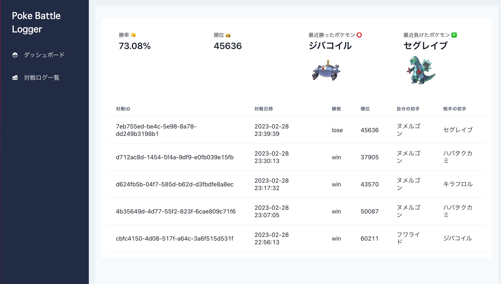

# PokeBattleLogger



ポケモンSV のランクマッチ(マスターボール以上) の youtube 配信から、対戦データを抽出します。

🚧 This app is Under Construction 🚧

現在開発中です。

## Notification

- 対応環境(2023/03/06 時点)
  - 言語選択が英語の場合のみに対応しています。
  - 動画のサイズは 720p: 1280 x 720 (HD) のみに対応しています。
- 必ず「続ける」or「対戦チームを変える」で順位を表示する必要があります。表示されていない場合、正常に動作しません。
- また、バトルスタジアムから抜ける場合は動画を切って頂く必要があります。
- 何らかの理由で順位が変動しなかった試合についてはデータ抽出を行いません。

## Setup

Pyton 3.10 +

```
poetry install
```

## Batch

Tesseract を用いるので、環境変数を設定する必要があります。

```
TESSDATA_PREFIX=/opt/brew/Cellar/tesseract/5.3.0_1/share/tessdata/ \
VIDEO_ID={your_pokemon_sv_rank_match_stream_id} make extract-data
```

抽出したデータは sqlite に保存されます。

## Visualize App

```
make run-dashboard
```

### API

```
poetry run uvicorn poke_battle_logger.api.app:app
```
